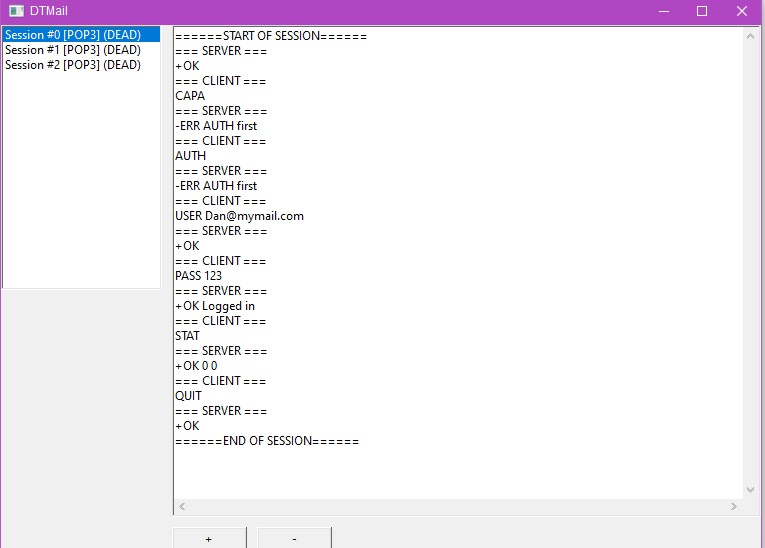
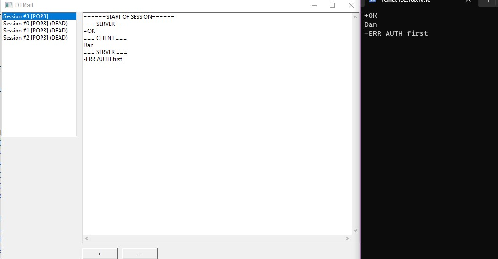
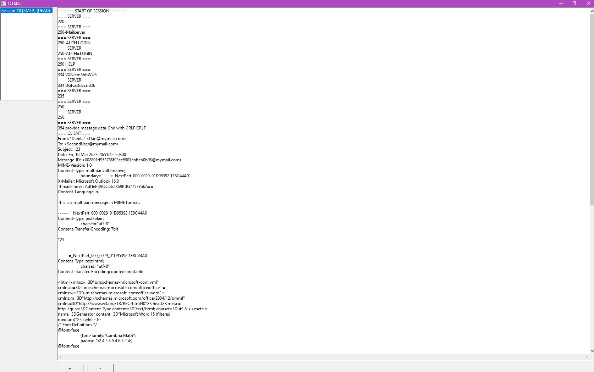
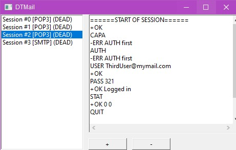
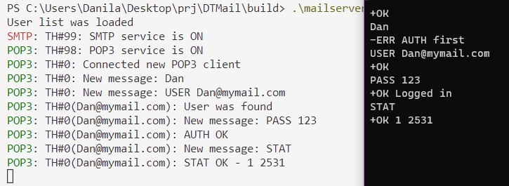
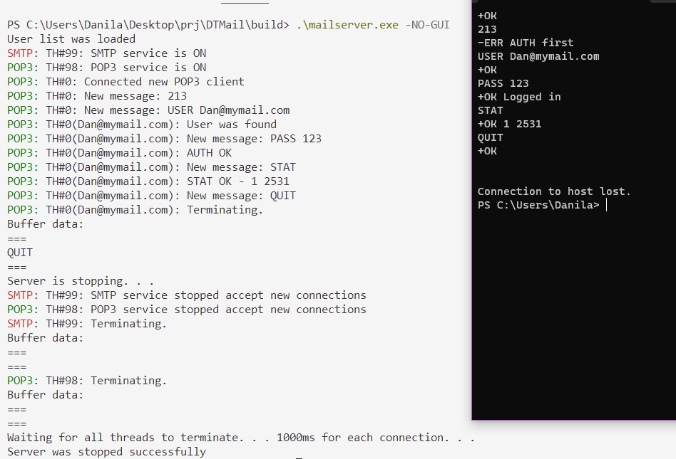
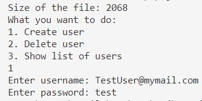
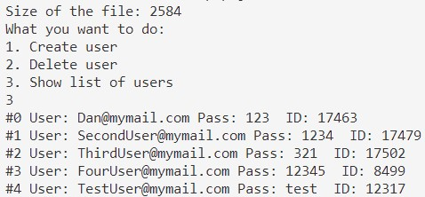

# DTMail

[Compiled version](https://github.com/DanArmor/DTMail/releases)

*DTMail (Dev&Test Mail)* - Mail Server (SMTP/POP3) for developers of mail clients for local testing and developing purposes. Created with WinAPI - so you can run it only on Windows x64.

You're beginner developer, who decided to practice by creating mail POP3/SMTP client or just doing that as fun task? That little server will help you to test your client locally.

There is simple GUI: it shows logs for active and dead sessions.

If you don't like prefixes `SERVER` and `CLIENT` you can disable it with `-NO-PREF` flag:

Also it has TUI:

You can run just TUI with `-NO-GUI` flag:

If you started with no GUI - you can stop server with `Ctrl-c`.

SMTP supported commands:
* EHLO
* MAIL FROM
* RCPT TO
* DATA
* QUIT
* AUTH LOGIN (base64)

POP3 supported commands:
* USER
* PASS
* STAT
* LIST
* QUIT
* RETR
* DELE

To server user list you need to run `husers.exe` and restart server.

To compile server you need iup(https://www.tecgraf.puc-rio.br/iup/) for GUI.